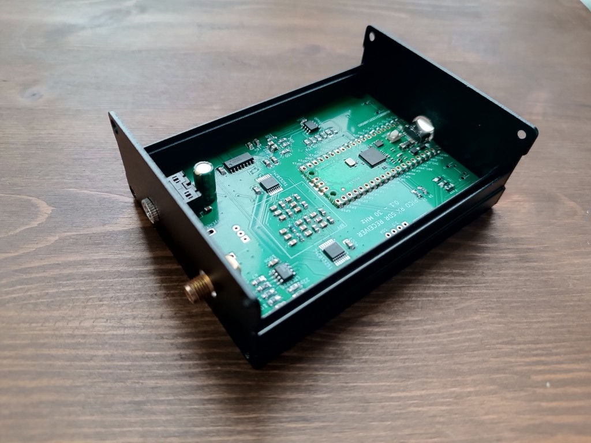
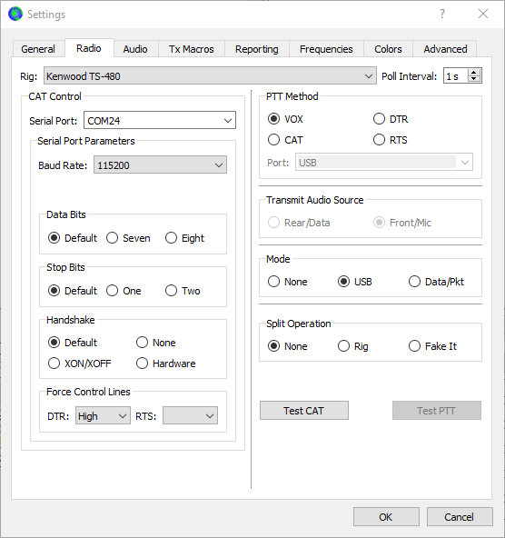
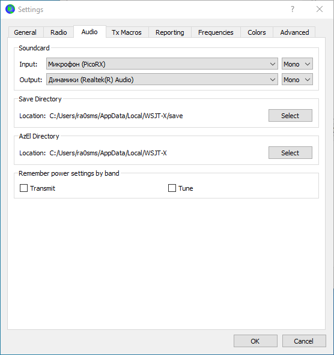
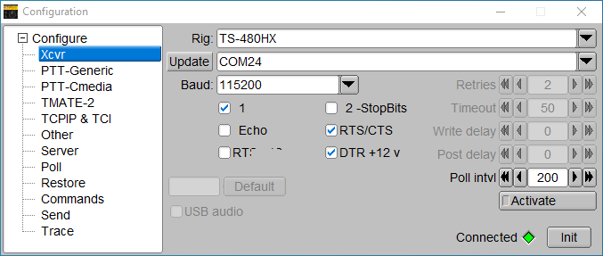
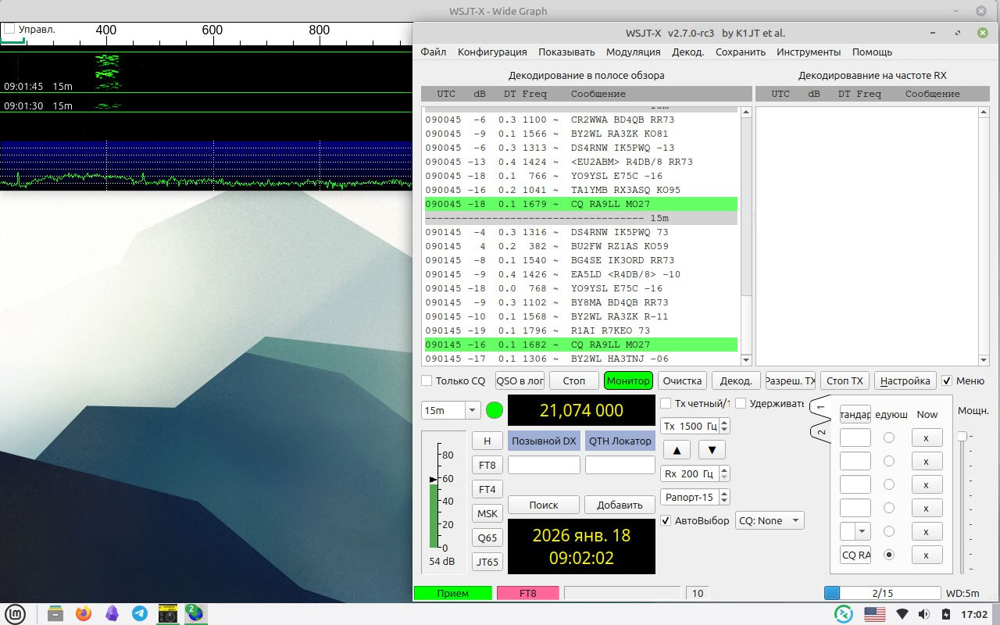

# SDR receiver Pico RX for DIGI modes

This is a clone of Jon Dawson's project [PicoRX SDR](https://github.com/dawsonjon/PicoRX).

But I wanted to make a simple DIGI (WSPR, FT8) receiver. This modification works with PC and WSJT-X software by one USB Type-C cable.

More information - https://ra0sms.com/picorx-digi-modes

## Settings

You need to connect receiver to PC by USB cable. And select COM-port and Audio input like on the pictures below.

Or if you use FLrig software

Now you can see decodes.

